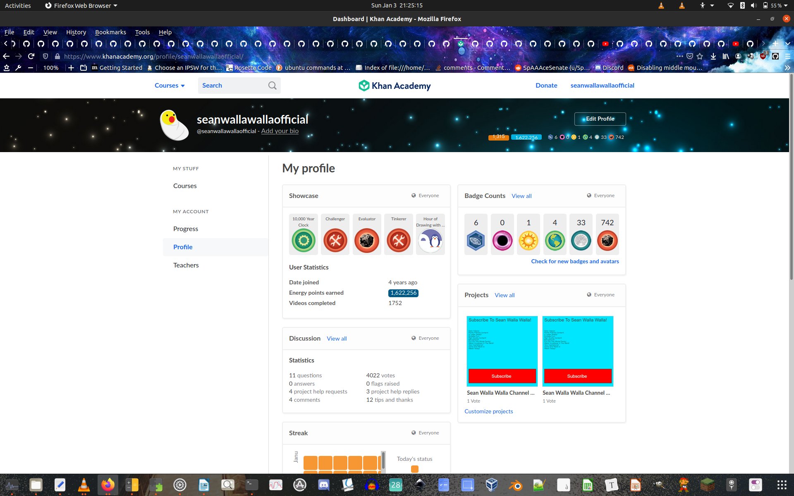

***

**Caption:** `the latest consecutive day picture before the removal of the consecutive day count`

# `README.md`

***

## Read this article in a different language

_🌐 List of languages_

**Sorted by:** `A-Z`

[Sorting options unavailable](https://github.com/seanpm2001/KhanAcademyData_u-Seanwallawallaofficial/)

( [af Afrikaans](/.github/README_AF.md) Afrikaans | [sq Shqiptare](/.github/README_SQ.md) Albanian | [am አማርኛ](/.github/README_AM.md) Amharic | [ar عربى](/.github/README_AR.md) Arabic | [hy հայերեն](/.github/README_HY.md) Armenian | [az Azərbaycan dili](/.github/README_AZ.md) Azerbaijani | [eu Euskara](/.github/README_EU.md) Basque | [be Беларуская](/.github/README_BE.md) Belarusian | [bn বাংলা](/.github/README_BN.md) Bengali | [bs Bosanski](/.github/README_BS.md) Bosnian | [bg български](/.github/README_BG.md) Bulgarian | [ca Català](/.github/README_CA.md) Catalan | [ceb Sugbuanon](/.github/README_CEB.md) Cebuano | [ny Chichewa](/.github/README_NY.md) Chichewa | [zh-CN 简体中文](/.github/README_ZH-CN.md) Chinese (Simplified) | [zh-t 中國傳統的）](/.github/README_ZH-T.md) Chinese (Traditional) | [co Corsu](/.github/README_CO.md) Corsican | [hr Hrvatski](/.github/README_HR.md) Croatian | [cs čeština](/.github/README_CS.md) Czech | [da dansk](README_DA.md) Danish | [nl Nederlands](/.github/README_NL.md) Dutch | [**en-us English**](/.github/README.md) English |  [EO Esperanto](/.github/README_EO.md) Esperanto | [et Eestlane](/.github/README_ET.md) Estonian | [tl Pilipino](/.github/README_TL.md) Filipino | [fi Suomalainen](/.github/README_FI.md) Finnish |  [fr français](/.github/README_FR.md) French | [fy Frysk](/.github/README_FY.md) Frisian | [gl Galego](/.github/README_GL.md) Galician | [ka ქართველი](/.github/README_KA) Georgian | [de Deutsch](/.github/README_DE.md) German | [el Ελληνικά](/.github/README_EL.md) Greek | [gu ગુજરાતી](/.github/README_GU.md) Gujarati | [ht Kreyòl ayisyen](/.github/README_HT.md) Haitian Creole | [ha Hausa](/.github/README_HA.md) Hausa | [haw Ōlelo Hawaiʻi](/.github/README_HAW.md) Hawaiian | [he עִברִית](/.github/README_HE.md) Hebrew | [hi हिन्दी](/.github/README_HI.md) Hindi | [hmn Hmong](/.github/README_HMN.md) Hmong | [hu Magyar](/.github/README_HU.md) Hungarian | [is Íslenska](/.github/README_IS.md) Icelandic | [ig Igbo](/.github/README_IG.md) Igbo | [id bahasa Indonesia](/.github/README_ID.md) Icelandic | [ga Gaeilge](/.github/README_GA.md) Irish | [it Italiana/Italiano](/.github/README_IT.md) | [ja 日本語](/.github/README_JA.md) Japanese | [jw Wong jawa](/.github/README_JW.md) Javanese | [kn ಕನ್ನಡ](/.github/README_KN.md) Kannada | [kk Қазақ](/.github/README_KK.md) Kazakh | [km ខ្មែរ](/.github/README_KM.md) Khmer | [rw Kinyarwanda](/.github/README_RW.md) Kinyarwanda | [ko-south 韓國語](/.github/README_KO_SOUTH.md) Korean (South) | [ko-north 문화어](README_KO_NORTH.md) Korean (North) (NOT YET TRANSLATED) | [ku Kurdî](/.github/README_KU.md) Kurdish (Kurmanji) | [ky Кыргызча](/.github/README_KY.md) Kyrgyz | [lo ລາວ](/.github/README_LO.md) Lao | [la Latine](/.github/README_LA.md) Latin | [lt Lietuvis](/.github/README_LT.md) Lithuanian | [lb Lëtzebuergesch](/.github/README_LB.md) Luxembourgish | [mk Македонски](/.github/README_MK.md) Macedonian | [mg Malagasy](/.github/README_MG.md) Malagasy | [ms Bahasa Melayu](/.github/README_MS.md) Malay | [ml മലയാളം](/.github/README_ML.md) Malayalam | [mt Malti](/.github/README_MT.md) Maltese | [mi Maori](/.github/README_MI.md) Maori | [mr मराठी](/.github/README_MR.md) Marathi | [mn Монгол](/.github/README_MN.md) Mongolian | [my မြန်မာ](/.github/README_MY.md) Myanmar (Burmese) | [ne नेपाली](/.github/README_NE.md) Nepali | [no norsk](/.github/README_NO.md) Norwegian | [or ଓଡିଆ (ଓଡିଆ)](/.github/README_OR.md) Odia (Oriya) | [ps پښتو](/.github/README_PS.md) Pashto | [fa فارسی](/.github/README_FA.md) |Persian  [pl polski](/.github/README_PL.md) Polish | [pt português](/.github/README_PT.md) Portuguese | [pa ਪੰਜਾਬੀ](/.github/README_PA.md) Punjabi | No languages available that start with the letter Q | [ro Română](/.github/README_RO.md) Romanian | [ru русский](/.github/README_RU.md) Russian | [sm Faasamoa](/.github/README_SM.md) Samoan | [gd Gàidhlig na h-Alba](/.github/README_GD.md) Scots Gaelic | [sr Српски](/.github/README_SR.md) Serbian | [st Sesotho](/.github/README_ST.md) Sesotho | [sn Shona](/.github/README_SN.md) Shona | [sd سنڌي](/.github/README_SD.md) Sindhi | [si සිංහල](/.github/README_SI.md) Sinhala | [sk Slovák](/.github/README_SK.md) Slovak | [sl Slovenščina](/.github/README_SL.md) Slovenian | [so Soomaali](/.github/README_SO.md) Somali | [[es en español](/.github/README_ES.md) Spanish | [su Sundanis](/.github/README_SU.md) Sundanese | [sw Kiswahili](/.github/README_SW.md) Swahili | [sv Svenska](/.github/README_SV.md) Swedish | [tg Тоҷикӣ](/.github/README_TG.md) Tajik | [ta தமிழ்](/.github/README_TA.md) Tamil | [tt Татар](/.github/README_TT.md) Tatar | [te తెలుగు](/.github/README_TE.md) Telugu | [th ไทย](/.github/README_TH.md) Thai | [tr Türk](/.github/README_TR.md) Turkish | [tk Türkmenler](/.github/README_TK.md) Turkmen | [uk Український](/.github/README_UK.md) Ukrainian | [ur اردو](/.github/README_UR.md) Urdu | [ug ئۇيغۇر](/.github/README_UG.md) Uyghur | [uz O'zbek](/.github/README_UZ.md) Uzbek | [vi Tiếng Việt](/.github/README_VI.md) Vietnamese | [cy Cymraeg](/.github/README_CY.md) Welsh | [xh isiXhosa](/.github/README_XH.md) Xhosa | [yi יידיש](/.github/README_YI.md) Yiddish | [yo Yoruba](/.github/README_YO.md) Yoruba | [zu Zulu](/.github/README_ZU.md) Zulu ) Available in 110 languages (108 when not counting English and North Korean, as North Korean has not been translated yet [Read about it here](/OldVersions/Korean(North)/README.md))

Translations in languages other than English are machine translated and are not yet accurate. No errors have been fixed yet as of March 21st 2021. Please report translation errors [here](https://github.com/seanpm2001/SeansLifeArchive_Images_AndrOpen-Office/issues/). Make sure to backup your correction with sources and guide me, as I don't know languages other than English well (I plan on getting a translator eventually) please cite [wiktionary](https://en.wiktionary.org) and other sources in your report. Failing to do so will result in a rejection of the correction being published.

Note: due to limitations with GitHub's interpretation of markdown (and pretty much every other web-based interpretation of markdown) clicking these links will redirect you to a separate file on a separate page that isn't my GitHub profile page. You will be redirected to the [seanpm2001/seanpm2001 repository](https://github.com/seanpm2001/seanpm2001), where the README is hosted.

Translations are done with Google Translate due to limited or no support for the languages I need in other translation services like DeepL and Bing Translate (pretty ironic for an anti-Google campaign) I am working on finding an alternative. For some reason, the formatting (links, dividers, bolding, italics, etc.) is messed up in various translations. It is tedious to fix, and I do not know how to fix these issues in languages with non-latin characters, and right to left languages (like Arabic) extra help is needed in fixing these issues

Due to maintenance issues, many translations are out of date and are using an outdated version of this `README` article file. A translator is needed. Also, as of April 9th 2021, it is going to take me a while to get all the new links working.

***

# Index

[00.0 - Title](#README.md)

> [00.1 - Read this article in a different language](#Read-this-article-in-a-different-language)

[01.0 - Index (recursive)](#Index)

[02.0 - Description](#KhanAcademyData_u-Seanwallawallaofficial)

[03.0 - About](#About)

[04.0 - Current issues](#Current_issues)

[05.0 - Major issues](#Major_issues)

[06.0 - Pending features](#Pending_features)

[07.0 - Monthly logs](#Monthly_logs)

[08.0 - File naming history](#File_naming_history)

[09.0 - About the tree INI](#About_the_tree_INI)

[10.0 - Episode series](#Episode_series)

[11.0 - Programs used](#Programs_used)

[12.0 - Devices used](#Devices_used)

[13.0 - Documentation](#Documentation)

[14.0 - Courses](#Courses)

[15.0 - Programming projects](#Programming_projects)

> [15.0.1 - JavaScript projects](#JavaScript_projects)

> [15.0.2 - SQL projects](#SQL_projects)

[16.0 - Goals](#Goals)

[17.0 - Starter info](#Starter_info)

[18.0 - Contributing](#Contributing)

[19.0 - Wiki](#Wiki)

[20.0 - Sponsor info](#Sponsor-info)

[21.0 - Software status](#Software-status)

[22.0 - Issues](#Issues)

> [22.1 - Current issues](#Current-issues)

> [22.2 - Past issues](#Past-issues)

> [22.3 - Past pull requests](#Past-pull-requests)

> [22.4 - Active pull requests](#Active-pull-requests)

[23.0 - Version history](#Version_history)

[24.0 - Contributers](#Contributers)

[25.0 - Contributing](#Contributing)

[26.0 - Resources](#Resources)

[27.0 - Notes for future README updates](#Notes_for_future_README_updates)

[28.0 - About README.md](#About_README.md)

[29.0 - File history](#File_history)

[30.0 - Footer](#You_have_reached_the_end_of_the_README_file)

> [30.5 - End of file](#EOF)

***

## KhanAcademyData_u-Seanwallawallaofficial
All of my Khan Academy data from my main account and my school account. The school account no longer exists. Link to my profile: https://www.khanacademy.org/profile/seanwallawallaofficial/

***

## About

See above

***

## Current issues

These issues are currently needing to be fixed:

1. [#1 Root folder is missing](https://github.com/seanpm2001/KhanAcademyData_u-Seanwallawallaofficial/issues/1)

2. No other issues at the moment

***

## Major issues

On January 4th 2021, Khan Academy unexpectedly removed the consecutive day count tracker. This feature was not just an incentive, it was very helpful for tracking the days you are on and the days you aren't. All badges related to consecutive days were retired as well. This should have never been done in the first place, but even so, there should have been at least a weeks notice for the feature.

This unexpected removal left a massive negative stain on me mentally for the day, and now I am trying to decide whether I should keep using Khan Academy. What if they remove badges next? Energy points? Any kind of customization? Who knows? When you unexpectedly do something like this without giving a reason, it becomes hard to trust that everything won't get removed. Slowly, everything that makes Khan Academy unique is being removed. If they continue to do this, they are really going to lose users. I am so disappointed in this decision.

I still am locked on to Khan Academy until December 31st 2021, but now I have to decide if I am going to keep using Khan Academy after this point. The consecutive day count meter was one of my proudest achievements on the site. 1315 consecutive days are now gone, just like that, with no reason at all.

As of January 5th 2021, I am undecided.

***

## Pending features

These features are pending:

1. [KDE icon support](https://www.kde.org/)

2. [GNOME icon support](https://www.gnome.org/)

3. [MacOS icon support](https://www.apple.com)

4. [XFCE icon support](https://xfce.org/)

5. [Solaris icon support](https://www.oracle.com/solaris/solaris11/)

6. [CINNAMON icon support](https://cinnamon-spices.linuxmint.com/)

7. [Other DE icon support](https://en.wikipedia.org/wiki/Desktop_environment)

8. No other pending features at the moment

***

## Monthly logs

This is a list of monthly logs of README files for this project

<html>

<a href="/KhanAcademyDailyPictures/2017/May/README.md">May 2017</a>
  
<a href="/KhanAcademyDailyPictures/2017/June/README.md">June 2017</a>

<a href="/KhanAcademyDailyPictures/2017/December/README.md">December 2017</a>

<a href="/KhanAcademyDailyPictures/2018/June/README.md">June 2018</a>

<a href="/KhanAcademyDailyPictures/2018/July/README.md">July 2018</a>

<a href="/KhanAcademyDailyPictures/2018/August/README.md">August 2018</a>

<a href="/KhanAcademyDailyPictures/2018/September/README.md">September 2018</a>

<a href="/KhanAcademyDailyPictures/2018/October/README.md">October 2018</a>

<a href="/KhanAcademyDailyPictures/2018/November/README.md">November 2018</a>

<a href="/KhanAcademyDailyPictures/2018/December/README.md">December 2018</a>

<a href="/KhanAcademyDailyPictures/2019/January/README.md">January 2019</a>

<a href="/KhanAcademyDailyPictures/2019/February/README.md">February 2019</a>

<a href="/KhanAcademyDailyPictures/2019/March/README.md">March 2019</a>

<a href="/KhanAcademyDailyPictures/2019/April/README.md">April 2019</a>

<a href="/KhanAcademyDailyPictures/2019/May/README.md">May 2019</a>

<a href="/KhanAcademyDailyPictures/2019/June/README.md">June 2019</a>

<a href="/KhanAcademyDailyPictures/2019/July/README.md">July 2019</a>

<a href="/KhanAcademyDailyPictures/2019/August/README.md">August 2019</a>

<a href="/KhanAcademyDailyPictures/2019/September/README.md">September 2019</a>

<a href="/KhanAcademyDailyPictures/2019/October/README.md">October 2019</a>

<a href="/KhanAcademyDailyPictures/2019/November/README.md">November 2019</a>

<a href="/KhanAcademyDailyPictures/2019/December/README.md">December 2019</a>

<a href="/KhanAcademyDailyPictures/2020/January/README.md">January 2020</a>

<a href="/KhanAcademyDailyPictures/2020/February/README.md">February 2020</a>

<a href="/KhanAcademyDailyPictures/2020/March/README.md">March 2020</a>

<a href="/KhanAcademyDailyPictures/2020/April/README.md">April 2020</a>

<a href="/KhanAcademyDailyPictures/2020/May/README.md">May 2020</a>

<a href="/KhanAcademyDailyPictures/2020/June/README.md">June 2020</a>

<a href="/KhanAcademyDailyPictures/2020/July/README.md">July 2020</a>

<a href="/KhanAcademyDailyPictures/2020/August/README.md">August 2020</a>

<a href="/KhanAcademyDailyPictures/2020/September/README.md">September 2020</a>

<a href="/KhanAcademyDailyPictures/2020/October/README.md">October 2020</a>

<a href="/KhanAcademyDailyPictures/2020/November/README.md">November 2020</a>

<a href="/KhanAcademyDailyPictures/2020/December/README.md">December 2020</a>

<a href="/KhanAcademyDailyPictures/2021/January/README.md">January 2021</a>

<a href="/KhanAcademyDailyPictures/2021/February/README.md">February 2021</a>

<a href="/KhanAcademyDailyPictures/2021/March/README.md">March 2021</a>

<a href="/KhanAcademyDailyPictures/2021/April/README.md">April 2021</a>

<a href="/KhanAcademyDailyPictures/2021/May/README.md">May 2021</a>

<a href="/KhanAcademyDailyPictures/2021/June/README.md">June 2021</a>

<a href="/KhanAcademyDailyPictures/2021/July/README.md">July 2021</a>

<a href="/KhanAcademyDailyPictures/2021/August/README.md">August 2021</a>

<a href="/KhanAcademyDailyPictures/2021/September/README.md">September 2021</a>

<a href="/KhanAcademyDailyPictures/2021/October/README.md">October 2021</a>

<a href="/KhanAcademyDailyPictures/2021/November/README.md">November 2021</a>

<a href="/KhanAcademyDailyPictures/2021/December/README.md">December 2021</a>

</html>

***

## File naming history

This is the history of the file naming process for this project:

2017-2018: original screenshot labeled "screenshot.png" 6 other image files for different parts of the screen

2019-late 2020: screenshot labeled "KhanAcademy_Day`x`"

late 2020-present: screenshot labeled "KhanAcademy_Day`x`_Month`xx`2020_1080p, mobile screenshots unchanged

I thought this would be more interesting. Maybe I am missing some info

***

## About the tree INI

In the early days of the Khan Academy image structure, separate folders were given a custom icon in Windows 10, resembling a tree. Windows users (Windows 3.1 and up) can see an icon for a tree (meant to resemble the Khan Academy logo) on several Khan Academy image folders due to a `desktop.ini` file placed in their folders. This was not maintained, and stopped after a while.

***

## Episode series

I started a Khan Academy statistic series on YouTube for my early Khan Academy history from 2017 to late 2018, but then I stopped.

The video project files and videos themselves are still being uploaded, I have just taken a long hiatus.

***

## Programs used

I used several programs to create images and videos of Khan Academy progress. The programs include:

* Snipping tool (for images)

* Snip & sketch (for images)

* MS-PAINT 10.0 (for images, up to ~2019)

* Linux screenshot (for images, as of July 9th 2020)

* Windows Live Movie Maker 2012 (for videos, up to ~2019)

* Photo story 3 (for videos, up to ~2018)

* Firefox (for capture, from 2018 to present)

* Chrome (for capture, up to ~2018)

* Adobe Photoshop CC 2015 (for editing, 2017 to 2018)

* Adobe Photoshop CS6 (for editing, 2017 to 2018)

I used the following operating systems:

* Windows 10 (start to July 9th 2020) - NT-based

* Ubuntu 20.04 "Focal Fossa" (July 9th 2020 to present) - Linux-based

***

## Devices used

I used 3 different laptops for this project, all of them were Dell laptops (the latest being an XPS 13)

Laptop 1: Dell ??? (2017 to late 2018, then again in late 2018 to early 2018)

Laptop 2: Dell ??? (early 2019 to July 9th 2020)

Laptop 3: Dell XPS 13 9600 (JUly 9th 2020 to present)

***

## Documentation

Like most of my older projects, unfortunately I didn't start documentation immediately. This one however a very long time before documentation started, over 6 months.

[This file](PHOTOGRAPHY_PROCESS.md) goes into detail on my progress on Khan Academy documentation.

***

## Courses

These are the Khan Academy courses I have taken:

> Electrical engineering

> Computer programming

> Computer science

> Pixar in a Box

> Pre-Algebra

> Algebra I

> Algebra II

> Precalculus

> AP®︎/College Calculus AB

> US history

> World History

> World History Origins

> Biology (current, January 6th 2021)

***

## Programming projects

I started programming on Khan Academy in the beginning. As of 2020, I no longer take Khan Academy programming courses.

### JavaScript projects

KA_Main_Sean-Walla-Walla-Channel-Advertisement.js

KA_Main_Spin-off-of-Project-Animal-attack.js

KA_Main_Spin-off-of-challenge-bouncy-ball.js

KA_Main_Spin-off-of-challenge-calculator.js

KA_Main_Spin-off-of-challenge-mouse-tracker.js

KA_Main_Spin-off-of-challenge-waving-snowman.js

KA_Main_Spin-off-of-challenge-your-first-button.js

KA_Main_Spin-off-of-challenge-your-first-buttonV2.js

KA_Main_Spin-off-of-project-build-a-house.js

KA_Main_Spin-off-of-project-fish-tank.js

KA_Main_Spin-off-of-project-paint-splatter.js

KA_Main_Spin-off-of-project-whats-for-dinner.js

KA_Main_spin-off-of-project-shooting-star.js 

### SQL projects

KA_Main_Challenge-Book-list-database-seanwallawallas-favorite-books-query.sql

KA_Main_Spin-off-Of-Project-Design-a-store-database.sql

KA_Main_Spin-off-of-project-famous-people.sql 

The projects have been archived into this project. You can preview them here:

[JavaScript projects](https://github.com/seanpm2001/KhanAcademyData_u-Seanwallawallaofficial/tree/master/ProjectPreview/MainAccount/JavaScript)

[SQL projects](https://github.com/seanpm2001/KhanAcademyData_u-Seanwallawallaofficial/tree/master/ProjectPreview/MainAccount/SQL)

***

## Goals

I currently don't have any major goals on Khan Academy.

***

## Starter info

No TL;DR currently available.

***

## Contributing

[Click here to learn how to contribute](/CONTRIBUTING.md)

***

## Wiki

[Click/tap here to view this projects Wiki](https://github.com/seanpm2001/KhanAcademyData_u-Seanwallawallaofficial/wiki/)

If the project has been forked, the Wiki was likely removed. Luckily, I include an embedded version. You can view it [here](/External/ProjectWiki/).

***

## Sponsor info

You can sponsor this project if you like, but please specify what you want to donate to. [See the funds you can donate to here](https://github.com/seanpm2001/Sponsor-info/tree/main/For-sponsors/)

You can view other sponsor info [here](https://github.com/seanpm2001/Sponsor-info/)

Try it out! The sponsor button is right up next to the watch/unwatch button.

***

## Software status

All of my works are free some restrictions. DRM (**D**igital **R**estrictions **M**anagement) is not present in any of my works.

This sticker is supported by the Free Software Foundation. I never intend to include DRM in my works.

I am ussing the abbreviation "Digital Restrictions Management" instead of the more known "Digital Rights Management" as the common way of addressing it is false, there are no rights with DRM. The spelling "Digital Restrictions Management" is more accurate, and is supported by [Richard M. Stallman (RMS)](https://en.wikipedia.org/wiki/Richard_Stallman/) and the [Free Software Foundation (FSF)](https://en.wikipedia.org/wiki/Free_Software_Foundation/)

This section is used to raise awareness for the problems with DRM, and also to protest it. DRM is defective by design and is a major threat to all computer users and software freedom.

Image credit: [defectivebydesign.org/drm-free/...](https://www.defectivebydesign.org/drm-free/how-to-use-label/)

***

***

## Issues

### Current issues

* [1: Root folder is missing #1 ](https://github.com/seanpm2001/KhanAcademyData_u-Seanwallawallaofficial/issues/1)

* [4: The main README.md file needs an update #4 ](https://github.com/seanpm2001/KhanAcademyData_u-Seanwallawallaofficial/issues/4)

* [5: Formatted directories need to be made for 2018 #5 ](https://github.com/seanpm2001/KhanAcademyData_u-Seanwallawallaofficial/issues/5)

* [6: Output demo for programs #6 ](https://github.com/seanpm2001/KhanAcademyData_u-Seanwallawallaofficial/issues/6)

* [7: Files from January 2018 to May 31st 2018 inaccessible #7 ](https://github.com/seanpm2001/KhanAcademyData_u-Seanwallawallaofficial/issues/7)

* [8: (Feature request) YouTube channel data #8 ](https://github.com/seanpm2001/KhanAcademyData_u-Seanwallawallaofficial/issues/8)

* [9: Original directory system #9 ](https://github.com/seanpm2001/KhanAcademyData_u-Seanwallawallaofficial/issues/9)

* [12: Find/recreate data for August 5th 2018 #12 ](https://github.com/seanpm2001/KhanAcademyData_u-Seanwallawallaofficial/issues/12)

* No other current issues

If the repository has been forked, issues likely have been removed. Luckily I keep an archive of certain images [here](/.github/Issues/)

[Read the privacy policy on issue archival here](/.github/Issues/README.md)

**TL;DR**

I archive my own issues. Your issue won't be archived unless you request it to be archived.

### Past issues

* [2: IGNORE.md files prior to June 11th 2020 subject for deletion #2](https://github.com/seanpm2001/KhanAcademyData_u-Seanwallawallaofficial/issues/2)

* [3: 6.16.2020-6.19.2020 need to be added #3 ](https://github.com/seanpm2001/KhanAcademyData_u-Seanwallawallaofficial/issues/3)

* [10: (Small feature request) Acronym file #10 ](https://github.com/seanpm2001/KhanAcademyData_u-Seanwallawallaofficial/issues/10)

* [11: Wiki needs to be moved to /external/ #11 ](https://github.com/seanpm2001/KhanAcademyData_u-Seanwallawallaofficial/issues/11)

If the repository has been forked, issues likely have been removed. Luckily I keep an archive of certain images [here](/.github/Issues/)

[Read the privacy policy on issue archival here](/.github/Issues/README.md)

**TL;DR**

I archive my own issues. Your issue won't be archived unless you request it to be archived.

### Past pull requests

None at the moment

If the repository has been forked, issues likely have been removed. Luckily I keep an archive of certain images [here](/.github/Issues/)

[Read the privacy policy on issue archival here](/.github/Issues/README.md)

**TL;DR**

I archive my own issues. Your issue won't be archived unless you request it to be archived.

### Active pull requests

None at the moment

If the repository has been forked, issues likely have been removed. Luckily I keep an archive of certain images [here](/.github/Issues/)

[Read the privacy policy on issue archival here](/.github/Issues/README.md)

**TL;DR**

I archive my own issues. Your issue won't be archived unless you request it to be archived.

***

## Version history

1. [Version 1.0](https://github.com/seanpm2001/KhanAcademyData_u-Seanwallawallaofficial/releases/tag/V1.0) - Released Tuesday, June 9th 2020 at 6:31 pm

2. [Version 1.01](https://github.com/seanpm2001/KhanAcademyData_u-Seanwallawallaofficial/releases/tag/V1.01) - Released Wednesday, June 10th 2020 at 11:00 pm

3. [Version 1.02](https://github.com/seanpm2001/KhanAcademyData_u-Seanwallawallaofficial/releases/tag/V1.02) - Released: Saturday, June 20th 2020 at 1:59 pm

4. [Version 1.03.0](https://github.com/seanpm2001/KhanAcademyData_u-Seanwallawallaofficial/releases/tag/V1.03.0) - Released: Thursday, July 16th 2020 at 3:41 pm

5. [Version 1.03.1](https://github.com/seanpm2001/KhanAcademyData_u-Seanwallawallaofficial/releases/tag/V1.03.1) - Released: Thursday, July 16th 2020 at 4:11 pm

6. I am not adding 30 releases right now

7. I am not adding 30 releases right now

8. I am not adding 30 releases right now

9. I am not adding 30 releases right now

10. I am not adding 30 releases right now

11. I am not adding 30 releases right now

12. I am not adding 30 releases right now

13. I am not adding 30 releases right now

14. I am not adding 30 releases right now

15. I am not adding 30 releases right now

16. I am not adding 30 releases right now

17. I am not adding 30 releases right now

18. I am not adding 30 releases right now

19. I am not adding 30 releases right now

20. I am not adding 30 releases right now

21. I am not adding 30 releases right now

22. I am not adding 30 releases right now

23. I am not adding 30 releases right now

24. I am not adding 30 releases right now

25. I am not adding 30 releases right now

26. I am not adding 30 releases right now

27. I am not adding 30 releases right now

28. I am not adding 30 releases right now

29. I am not adding 30 releases right now

30. I am not adding 30 releases right now

31. I am not adding 30 releases right now

32. I am not adding 30 releases right now

33. [Version 1.02](https://www.example.com) - Coming soon

ToDo: Update this section (outside contributors can help)

***

## Contributers

Currently, I am the only contributer.

> * 1. [seanpm2001](https://github.com/seanpm2001/) - 7676 commits (As of Thursday, July 15th 2021 at 8:24 pm)

> * 2. No other contributers at the moment

> * 3. Contributer slot 3

> * 4. Contributer slot 4

> * 5. Contributer slot 5

> * 6. Contributer slot 6

> * 7. Contributer slot 7

> * 8. Contributer slot 8

> * 9. Contributer slot 9

> * 10. Contributer slot 10

***

## Resources

[Project language file](PROJECT_LANG.js)

[Acronym list](AcronymList.md)

[Modern logo in JPG format](KALOGO.jpg)

[Modern logo in PNG format](KALOGO.png)

[Desktop.ini file](desktop.ini)

***

## Notes for future README updates

README update ideas August 1st 2020

Tree INI
Episodes

README update plans July 26th 2020

From some notes I wrote on this day:

Link to monthly logs
Browser history
OS History
File naming history
README.md history
Developer methods:
* Snipping tool
* Snip & sketch
* Linux screenshot
* Windows Live Movie Maker 2012
* MS-PAINT 10.0
* Photo story 3
* Firefox
* Chrome

Acronym list update (finished already)
INI, ODT, TXT, HTM, ZIP
Possibly:
PDF, EPUB, DOCX, DOC, ODT (nope, I checked)
Compare 3 versions {
Acronym list
Contributing
}

Laptop1
Laptop2
Laptop3

"Like most of my older projects, unfortunately I didn't start documentation immediately. This one however a very long time before documentation started, over 6 months"

November 21st 2020

README.MD V4
Include() {
KA logo
Resources section with images
Courses section
Code section
Goals section
Index
File history
Links
KA pics info
Starter info
}

***

## About README.md

File type: `Markdown (*.md)`

File version: `7 (Thursday, July 15th 2021 at 8:24 pm)`

Line count: `0,941`

***

## File history

Version 1 (Tuesday, June 9th 2020 at 6:30 pm)

> Changes:

> * Added the title section

> * Added the about section

> * Added the CONTRIBUTING section

> * Added the Wiki section

> * Added the contributers section

> * Added the version history section

> * Added the about README.md section

> * Added the footer

> * No other changes in version 1

Version 2 (Tuesday, June 9th 2020 at 6:46 pm)

> Changes:

> * Added the index

> * Updated the current issues section

> * Updated the about section

> * Updated the `contributers` section

> * Updated the `version history` section

> * No other changes in version 2

Version 3 (Wednesday, June 10th 2020 at 11:02 pm)

> Changes:

> * Updated the `version history` section

> * Updated the `About README.md` section

> * Updated the `Contributers` section

> * No other changes in version 3

Version 4 (Tuesday, January 5th 2021 at 8:08 pm)

> Changes:

> * Added the Khan Academy logo

> * Updated and optimized the index

> * Added the `major issues` section

> * Updated and optimized the `contributing` section

> * Updated the `version history` section

> * Updated the `contributers` section

> * Added the `resources` section 

> * Added the `README update notes` section

> * Updated the `About README.md` section

> * Added the file history section

> * No other changes in version 4

Version 5 (Wednesday, January 6th 2021 at 2:24 pm)

> Changes:

_Massive update, finalizing several months of ideas_

> * Updated the index

> * Added the `Monthly logs` section

> * Added the `File naming history` section

> * Added the `about the tree INI` section 

> * Added the `episode series` section

> * Added the `programs used` section

> * Added the `devices used` section

> * Added the `documentation` section

> * Added the `courses` section

> * Added the `programming projects` section

> > * Added the `JavaScript projects` sub-section

> > * Added the `SQL projects` sub-section

> * Added the `goals` section

> * Added the `starter info` section

> * Updated the file info section

> * Updated the file history section

> * Updated the title section

> * Updated the version history section

> * No other changes in version 5

Version 6 (Wednesday, March 17th 2021 at 5:02 pm)

> Changes:

> * Updated the index (9 new sections/subsections, added numbers)

> * Updated the monthly logs section

> * Added the issues section

> * Added the sponsor-info section

> * Updated the Wiki section

> * Updated the contributors section

> * Added the software status section

> * Updated the title section

> * Updated the file info section

> * Updated the file history section

> * No other changes in version 6

Version 7 (Thursday, July 15th 2021 at 8:24 pm)

> Changes:

> * Added the `read this article in a different language` subsection

> * Updated the index

> * Updated the file info section

> * Updated the file history section

> * Updated the footer

> * No other changes in version 7

Version 8 (Coming soon)

> Changes:

> * Coming soon

> * No other changes in version 8

Version 9 (Coming soon)

> Changes:

> * Coming soon

> * No other changes in version 9

Version 10 (Coming soon)

> Changes:

> * Coming soon

> * No other changes in version 10

***

## You have reached the end of the README file

( [Back to top](#Top) | [Exit to GitHub](https://github.com) )

### EOF

***
